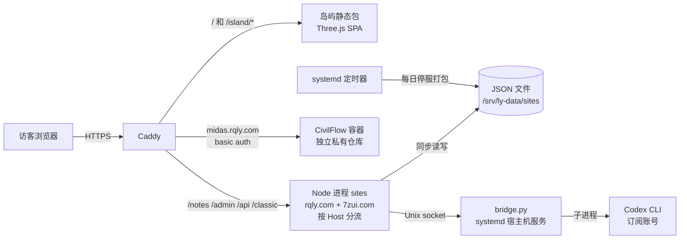

# 架构评估：ly-island（基于提交 4c832b1，2026-10-07）

这份评估回答一个问题：**这个架构能不能支撑一个人长期维护、内容持续增长的个人研究站？** 具体缺陷（性能、崩溃）见同目录的 `2026-10-07-findings.md`，这里只谈结构。

结论先说：**运行时架构是合理的，问题主要出在"怎么开发和发布"以及"内容模型"这两层。** 单机、单进程、JSON 文件存储、AI 隔离在宿主机，这些选择都符合当前规模，不需要推倒重来。真正会随时间越来越痛的是：代码的真相来源在服务器而不在 Git、内容分类写死在十几个文件里、研究写作需要的表达能力不够，以及维护面积已经远大于内容本身。

## 1. 系统全景

| 层 | 选择 | 评价 |
|---|---|---|
| 入口 | Caddy，自动 HTTPS，按路径分发 | 合适 |
| 公开前端 | 3D 岛屿 SPA 加一套服务端渲染的经典页面 | 两套渲染，见 3.5 |
| 应用 | 单个 Node 进程，零框架，手写路由 | 规模上合适，代码组织有问题，见 3.4 |
| 存储 | 每类数据一个 JSON 文件，同步读写，原子替换 | 当前规模合适，有明确上限，见 3.6 |
| AI | 宿主机 systemd 服务，Unix socket，只读沙箱，工具白名单，写入需站主确认 | 设计得很好 |
| CivilFlow | 独立仓库、独立容器，只通过链接接入 | 松耦合，正确 |
| 运维 | 本机每日备份、手工发布 | 见 3.1 |

## 2. 做对了的结构性决定

这些值得保留，后续改动不要破坏它们：

1. **没有引入数据库和框架。** 一个人维护的个人站，JSON 文件加单进程把运维成本压得很低，备份就是复制目录。
2. **"发布"和"编辑"是两个状态。** 自动保存只写私有草稿，明确确认才替换公开内容；历史只能恢复成草稿。这条约束在 REVIEW.md 里写清楚了，代码里也守住了。
3. **AI 被关在笼子里。** 模型不能执行 shell，不能直接访问数据；写入通过有限的工具，更新和发布要站主点确认，并绑定会话和文章版本。这比大多数"给网站接 AI"的做法都严谨。
4. **CivilFlow 不和主站耦合。** 只是一个链接，独立认证、独立部署，主站出问题不影响建模工具，反之亦然。
5. **优雅降级。** 没有 WebGL、加载超时、禁用 JavaScript，都有可读的退路。

## 3. 结构性问题

按"越往后越难改"的程度排序。

### 3.1 代码的真相来源在服务器，不在 Git（最重要）

**现状：**

- 仓库只有 1 个提交，是一次快照。README 明确写："现有线上服务仍从 `/opt/ly-stack/apps/` 运行……Git 拉取或合并不会自动替换生产服务。"
- `SOURCE-CHANGES.json` 的 `reason` 字段是一段 6,416 字符的累积说明，里面有 17 处 "User authorized/requested …"。这说明此前的改动是直接在服务器上一轮轮做出来，再记录下来的。
- `docs/provenance/` 里的哈希清单、`verify-sources.py`、部署说明里的手工 6 步，都在弥补"Git 不是来源"带来的问题。
- 文档里有 12 处 `/opt/ly-stack` 生产路径；岛屿 README 标题写 1.1.1，`package.json` 写 1.6.0。

**后果：**

- 没有可审查的历史：任何一次改动为什么这样做、改了哪几行，都无法追溯。
- 不能"回滚到上一个提交"，只能依赖服务器上的快照和镜像标签。
- 服务器和仓库会持续漂移，每次同步都要人工核对。
- 审查意见只能以"下载补丁再转述"的方式传递，根源也在这里。

**建议：** 反转方向，**Git 是唯一来源，服务器只部署打了标签的提交**。

1. 以后所有改动都走分支加 PR，CI 跑全部检查。
2. 写一个 `scripts/release.sh`：在服务器上 `git fetch` 指定标签，跑检查，用提交哈希给镜像打标签，`compose up`，等健康检查，失败就回到上一个标签。
3. `SOURCE-CHANGES.json`、provenance 清单、`verify-sources.py` 改为历史资料，不再维护。
4. 服务器上不再直接改源码。如果需要 AI 助手在服务器上工作，也让它提交到分支、开 PR，而不是改运行目录。

这一项做完，后面所有建议的成本都会下降。

### 3.2 维护面积远大于内容

各子系统源码体积（不含锁文件）：

| 子系统 | 体积 |
|---|---|
| 管理后台前端（编辑器、草稿、历史、图片库、目录、信箱、AI 对话） | 162 KB |
| 3D 岛屿与岛内阅读 | 144 KB |
| 服务端（路由、存储、认证） | 96 KB |
| 七嘴前端 | 39 KB |
| 经典公开页面 | 27 KB |
| AI 桥接 | 18 KB |

代码约 490 KB。随仓库提供的种子内容是 3 篇博客（线上实际篇数我看不到）。最大的子系统是后台，它在重新实现一个 CMS：草稿、历史版本、回收站、版本冲突、图片引用管理。

这不是说这些功能做得不好，而是说**一个人的时间主要花在了维护平台上，而不是产出研究内容**。每增加一个功能，测试、备份、文档、发布都要跟着变。

**建议：** 不必删功能，但要做一次明确的取舍，并写下来作为边界：

- **核心（必须稳定）：** 写作与发布、研究内容展示、公开阅读。
- **展示性（可以慢）：** 3D 岛屿、成长积分。
- **待确认是否保留：**
  - 七嘴的第三条 AI 路径（OpenAI 兼容接口加访问码）：根目录 compose 里没有配置它需要的变量。
  - 早期双站部署包：`apps/rqly-sites/` 下的 `Caddyfile`、`compose*.yaml`、`README.md`。
  - 留言板公开回复。

之后新功能先问一句："它是在帮我产出研究内容，还是在扩大平台？"

另一个可选方向是把"写作"交给 Git：研究文章以 Markdown 文件放在仓库里，草稿是分支，历史是提交，审阅是 PR。这样后台的大部分复杂度可以去掉。代价是失去浏览器内写作和 AI 直接起草，是否值得由你决定。

### 3.3 内容模型写死在很多地方

- 分类 `'记录','工程','探索'` 出现在 8 个文件里，横跨服务端和岛屿前端（共 15 处 `'探索'`）。
- 内容类型 `'note','blog','project'` 出现在 5 个文件里。
- 三座建筑 `library/projects/workshop` 出现在 8 个文件里，搜索的 `scope` 映射也写死在 `search-core.mjs` 里。

**后果：** 想加一种内容（比如"研究问题"），或者加第四座建筑，需要改十来个文件、两个应用，还要同步改校验、搜索、AI 工具定义和测试，很容易漏。

同时，系统里已经有一套可配置的目录（`organization.json` 的标签、专题、系列），和写死的分类并存，两种机制做的是相近的事。

**建议：**

1. 建一个共享的内容模式模块，例如 `packages/content-schema/`，集中定义内容类型、分类、建筑与内容的映射，以及每种类型的字段。服务端校验、搜索、AI 工具 schema、岛屿前端都从这里导入。
2. 中期考虑把固定分类迁移到已有的目录系统，只保留"内容类型"作为代码级概念。

### 3.4 共享代码靠跨应用相对路径

岛屿前端直接导入 `../../rqly-sites/public/rqly/search-core.mjs` 和 `organization-core.mjs`。这能工作，但依赖关系是隐式的：改 `rqly-sites` 里的一个文件，可能悄悄打破另一个应用的构建，而两个应用的 CI 是分开跑的。

**建议：** 和 3.3 一起做。根目录启用 npm workspaces，把共享模块放进 `packages/`，两个应用显式声明依赖。

`server.mjs` 的组织问题（44 KB、手写路由链）在 `2026-10-07-findings.md` 的 B1 里，顺序是先格式化，再拆分。拆分时按职责分：HTTP 工具、模板渲染、Markdown、公开路由、管理路由、AI 路由。

### 3.5 研究内容的表达能力不够

这一点和你的研究方向直接相关。

**Markdown 渲染器**（`server.mjs:50` 到 `:67`）只支持标题、列表、引用、代码块、行内代码、粗体、链接、本站图片。**不支持：**

- 表格：桥梁参数、对比数据、有限元结果都需要。
- 公式：结构计算离不开。
- 斜体、脚注、图注、参考文献。

**岛屿里的文章地址是 hash**（`#room=library&article=slug`）：

- 文章打开时不改标题，也没有自己的分享卡片，分享出去全部显示首页信息。
- 搜索引擎不收录 hash 路由。
- 服务端其实有 `/notes/:slug` 这个真实地址，但岛屿阅读没有把它作为正式地址。

对一个希望被 AI、BIM、计算设计领域的人看到和引用的研究者来说，研究文章能被搜到、能被正确分享，比 3D 效果更关键。

**研究方向本身也没有对应的数据结构。** 你描述的四个方向里：

- 世界名桥库（RQ-1）是结构化数据：一座桥有类型、跨度、年代、施工方法。
- 点云拆分（RQ-2）和工作流审核（RQ-4）最好用可交互的演示来展示。

现在这些只能写成普通文章。

**建议：**

1. 把渲染器换成成熟的库（例如 `markdown-it` 加白名单清理），并加服务端渲染的 KaTeX。现有安全约束可以保留：只允许本站图片、链接白名单。
2. 以 `/notes/:slug` 作为文章的正式地址，带独立的标题和分享信息。岛屿内阅读用 `history.pushState` 切换到真实路径，而不是 hash。
3. 等 3.3 的内容模式模块做好后，再加"研究问题"类型（状态、流程节点、关联文章）。名桥库作为独立的结构化集合，不要塞进文章。

### 3.6 存储层的上限要写明

JSON 文件方案的极限不在"文件大小"，而在**每次请求都同步读、完整解析、写入时整体重写**。`2026-10-07-findings.md` 的 A1、A2 已经展示了这种模式一旦出现循环就会变成平方增长。

**建议：** 把迁移条件写进 REVIEW.md 的"当前边界"，到了就迁移，不要等出问题：

- 任何一个 JSON 文件超过约 5 MB；
- 公开接口的耗时在服务器上超过约 200 ms；
- 需要第二个进程（比如把七嘴拆出去）；
- 信箱条数接近上限 5000。

到时候迁到 SQLite（单文件，仍然只需复制即可备份）。迁移之前，先按 `2026-10-07-findings.md` 的 B5 加读缓存，并抽出统一的 JSON 存储模块。

### 3.7 七嘴与主站同一个进程

`rqly.com` 和 `7zui.com` 由同一个 Node 进程按 Host 分流，共用管理员认证。好处是部署简单；代价是七嘴的一个慢请求或崩溃会影响主站。当前规模可以接受，等到 3.6 触发拆进程时，七嘴是第一个可以拆出去的部分。

### 3.8 文档混合了三种东西

README 里同时有：项目说明、版本更新日志（0.5.0、0.6.0……）、生产服务器操作步骤（`/opt` 路径、inode、`cp` 命令）。

**建议：**

- README 只写"这是什么、怎么在本地跑"；
- 版本变化放 `CHANGELOG.md`；
- 服务器操作放 `docs/operations.md`；
- 重要的设计决定写成简短的决策记录（`docs/decisions/`），例如"为什么用 JSON 不用数据库""为什么 AI 写入要确认"。以后你或者别人来改代码时，就知道哪些约束不能动。

## 4. 演进路线

| 阶段 | 内容 | 前提 |
|---|---|---|
| 0：立刻（1 到 2 周） | Git 成为唯一来源，走 PR 流程（3.1）；合并本 PR 的两个修复；Prettier 格式化提交；备份只备数据与配置 | 你开通 GitHub 授权 |
| 1：近期 | 共享内容模式模块和 npm workspaces（3.3、3.4）；文章正式地址与分享信息、Markdown 支持表格和公式（3.5）；文档拆分（3.8） | 阶段 0 完成 |
| 2：按研究需要 | "研究问题"内容类型；名桥库作为结构化集合；点云和工作流演示 | 阶段 1 的模式模块 |
| 3：触发条件到了再做 | SQLite、拆分七嘴进程（3.6、3.7） | 3.6 中的任一条件 |

## 5. 需要你做的决定

这些我不替你决定：

1. **是否改为"Git 为唯一来源，服务器只部署标签"？** 这是其余所有建议的基础。CONTRIBUTING.md 要求改部署流程前先讨论，所以需要你确认。
2. **哪些功能是核心、哪些是展示、哪些可以删？** 尤其是七嘴的第三条 AI 路径、早期双站包、成长积分。
3. **研究写作是留在浏览器后台，还是改成 Git 里的 Markdown 文件？** 前者保留 AI 起草，后者大幅减少维护。
4. **岛屿是首页还是一个入口？** 如果目标受众是要找你研究成果的人，首页可能更适合直接展示研究，岛屿作为一个可以进入的展示空间。

## 6. 评估范围

- 已读：服务端全部模块、AI 工具与桥接结构、systemd 单元、Caddy 与 compose、备份与部署脚本、岛屿前端的入口、模块结构与路由方式。
- 未深入：`admin.js` 的内部逻辑、3D 场景实现细节、`bridge.py` 的逐行实现、CivilFlow 仓库（无权限）。
- 依赖安装受限，岛屿前端未构建，手机性能未实测。
- 线上实际内容量看不到，3.2 中的"内容少"只基于仓库里的种子数据，你可以对照线上数据判断。
